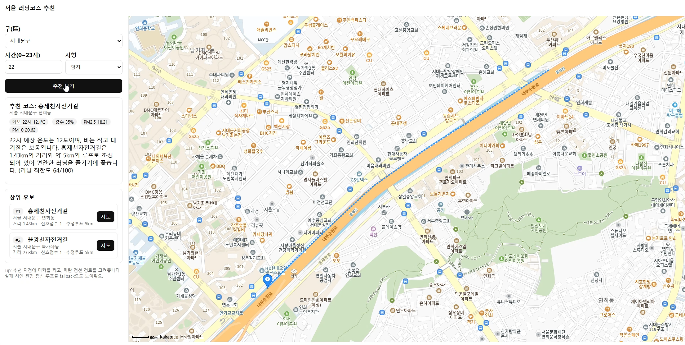
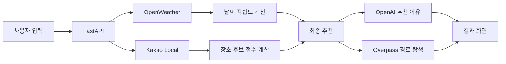

# Seoul Run

서울의 자치구, 달리고 싶은 시간, 선호 지형을 입력하면 날씨와 대기질, 주변 장소를 함께 분석해 러닝 코스를 추천하는 웹 애플리케이션입니다.

Kakao Local에서 장소 후보를 찾고 규칙 기반 점수로 순위를 계산합니다. OpenAI는 선택된 코스의 추천 이유를 한국어로 설명하며, OpenStreetMap의 보행·자전거 도로 데이터를 이용해 지도에 왕복 경로를 표시합니다.

## 실행 화면



지역, 시간, 선호 지형을 입력하면 추천 장소와 날씨 정보, 추천 이유 및 러닝 경로를 한 화면에서 확인할 수 있습니다.

## 프로젝트 배경

러닝 인구가 늘어나고 있지만 지도, 날씨, 대기질 정보는 서로 다른 서비스에서 확인해야 합니다. Seoul Run은 흩어진 정보를 하나의 추천 흐름으로 연결해 사용자가 서울 안에서 달릴 장소를 빠르게 탐색할 수 있도록 만든 프로젝트입니다.

개발 기간은 2025년 10월 20일부터 11월 1일까지이며, 실시간 외부 API를 결합한 추천 시스템의 설계와 구현을 학습하는 데 목적을 두었습니다.

## 주요 기능

- 서울 25개 자치구와 희망 시간 선택
- 평지 또는 경사 지형 선택
- 시간대별 예상 기온과 강수확률 조회
- PM2.5와 PM10을 반영한 러닝 적합도 계산
- Kakao Local 기반 러닝 장소 후보 검색
- 접근성, 신호 대기 가능성, 지형 특성을 반영한 상위 후보 추천
- OpenAI를 이용한 2~3문장의 한국어 추천 이유 생성
- OpenStreetMap 보행로·자전거도로 기반 왕복 경로 표시
- 외부 API 응답을 위한 인메모리 TTL 캐시
- 실제 경로 조회 실패 시 원형 안내 경로 표시

## 동작 흐름



1. 사용자가 자치구, 시간, 지형을 선택합니다.
2. 해당 구의 대표 좌표를 기준으로 예보와 대기질을 조회합니다.
3. 지형별 키워드로 Kakao Local의 장소 후보를 수집합니다.
4. 장소명에서 추정한 지형·신호 특성과 구 중심으로부터의 거리를 점수화합니다.
5. 상위 3개 후보와 최종 추천 장소를 정합니다.
6. OpenAI가 날씨와 추천 장소를 바탕으로 추천 이유를 생성합니다.
7. Overpass API에서 주변 길을 찾아 왕복 경로를 Kakao 지도에 표시합니다.

## 추천 점수

날씨 점수는 70점에서 시작해 기온, 강수확률, PM2.5, PM10에 따라 가감한 뒤 0~100점으로 제한합니다.

장소 후보 점수는 선택한 지형에 따라 다르게 계산합니다.

```text
평지 = 신호 점수 × 0.6 + 접근성 × 0.3 + 평탄함 × 0.1
경사 = 경사도 × 0.4 + 신호 점수 × 0.4 + 접근성 × 0.2

최종 점수 = 장소 후보 점수 × 0.6 + 날씨 점수 × 0.4
```

신호 점수와 경사도, 예상 코스 길이는 실제 측정값이 아니라 장소명에 포함된 `한강`, `수변`, `둘레길`, `산`, `정상` 등의 키워드로 추정한 휴리스틱 값입니다.

## 기술 스택

| 구분 | 기술 |
| --- | --- |
| Backend | Python 3.10+, FastAPI, Pydantic |
| Frontend | HTML, CSS, JavaScript |
| HTTP client | HTTPX |
| Map and local search | Kakao Maps, Kakao Local API |
| Weather and air quality | OpenWeather API |
| Route data | OpenStreetMap Overpass API |
| Natural-language explanation | OpenAI API |

## 프로젝트 구조

```text
seoul-run/
├── data/
│   └── seoul_gu_coords.json   # 서울 25개 자치구 대표 좌표
├── docs/
│   └── images/
│       └── demo.png           # 실행 화면
├── frontend/
│   └── index.html             # 입력 화면과 Kakao 지도
├── services/
│   ├── gpt_reason.py          # 추천 이유 생성과 템플릿 fallback
│   ├── kakao.py               # 장소 후보 검색
│   ├── openweather.py         # 날씨·예보·대기질 조회
│   ├── overpass.py            # OSM 경로 조회와 왕복 경로 생성
│   └── scoring.py             # 러닝 날씨 점수 계산
├── .env.example
├── .gitignore
├── main.py                    # FastAPI 애플리케이션과 추천 로직
├── requirements.txt
└── README.md
```

## 로컬 실행

### 1. 저장소 복제

```bash
git clone https://github.com/coffeeboy123/seoul_run.git
cd seoul_run
```

### 2. 가상환경 및 패키지 설치

Windows PowerShell 기준입니다.

```powershell
python -m venv .venv
.\.venv\Scripts\Activate.ps1
python -m pip install -r requirements.txt
```

### 3. 환경변수 설정

`.env.example`을 복사해 `.env`를 만들고 발급받은 키를 입력합니다.

```powershell
Copy-Item .env.example .env
```

```dotenv
OPENWEATHER_API_KEY=your_openweather_api_key
KAKAO_REST_API_KEY=your_kakao_rest_api_key
OPENAI_API_KEY=your_openai_api_key
OPENAI_MODEL=gpt-4o-mini
```

Kakao JavaScript 키는 `frontend/index.html`의 지도 SDK `appkey`에 설정해야 합니다. 브라우저에서 지도가 표시되도록 Kakao Developers에도 `http://127.0.0.1:5500` 또는 사용하는 배포 도메인을 등록해야 합니다.

> `.env`에는 비밀 키가 들어 있으므로 Git에 커밋하지 마세요.

### 4. 백엔드 실행

프로젝트 루트에서 실행합니다.

```powershell
python -m uvicorn main:app --reload --port 8002
```

- API: <http://127.0.0.1:8002>
- Swagger UI: <http://127.0.0.1:8002/docs>

### 5. 프론트엔드 실행

새 PowerShell 창에서 실행합니다.

```powershell
python -m http.server 5500 --bind 127.0.0.1 --directory frontend
```

브라우저에서 <http://127.0.0.1:5500>을 엽니다.

## API

| Method | Endpoint | 설명 |
| --- | --- | --- |
| `GET` | `/health` | 서버 상태 확인 |
| `GET` | `/weather` | 자치구와 시간 기준 날씨·대기질 조회 |
| `POST` | `/score` | 날씨 기반 러닝 적합도 계산 |
| `GET` | `/candidates` | 지형별 장소 후보 조회 |
| `POST` | `/recommend` | 상위 후보, 최종 추천, 추천 이유 생성 |
| `GET` | `/route` | 추천 지점 주변의 왕복 경로 생성 |

추천 요청 예시:

```json
{
  "gu": "서대문구",
  "hour": 22,
  "terrain": "평지"
}
```

## 캐시

외부 API의 응답시간과 호출량을 줄이기 위해 프로세스 메모리에 TTL 캐시를 사용합니다.

| 데이터 | 유지 시간 |
| --- | ---: |
| 날씨·대기질 | 10분 |
| 장소 후보 | 15분 |
| 경로 | 5분 |

서버를 재시작하면 캐시는 초기화됩니다.

## 한계와 개선 방향

- 장소 특성이 실제 고도나 신호등 데이터가 아닌 장소명 키워드에 기반합니다.
- 현재 경로는 완전한 순환 코스가 아니라 한 길을 따라갔다가 돌아오는 왕복 경로입니다.
- 공개 Overpass 서버가 요청을 거부하거나 지연되면 원형 안내 경로가 표시될 수 있습니다.
- 외부 API 상태에 따라 첫 추천 응답이 오래 걸릴 수 있습니다.
- 날씨 점수는 같은 요청의 모든 장소에 동일하게 적용되므로 후보 간 순위를 직접 바꾸지 않습니다.
- 장소의 휴장·폐업·공사 여부를 별도로 검증하지 않습니다.

향후에는 실제 고도 데이터와 교차로·신호등 수를 반영하고, 여러 도로를 연결하는 폐경로 탐색 알고리즘과 Overpass 다중 서버 fallback을 적용할 수 있습니다.

## 프로젝트를 통해 배운 점

- 여러 외부 REST API의 비동기 연동과 데이터 통합
- FastAPI를 이용한 백엔드 API 설계
- 규칙 기반 추천 점수 설계와 한계 분석
- TTL 캐시를 활용한 외부 호출 최적화
- LLM이 사실 데이터를 바탕으로 설명을 생성하도록 프롬프트 구성
- 지도 위에 좌표 배열을 경로로 시각화하는 방법

## 데이터 출처

- [OpenWeather](https://openweathermap.org/api): 날씨, 예보, 대기질
- [Kakao Developers](https://developers.kakao.com/): 장소 검색과 지도
- [OpenStreetMap](https://www.openstreetmap.org/) / [Overpass API](https://overpass-api.de/): 보행로와 자전거도로 경로
- [OpenAI](https://platform.openai.com/docs/): 추천 이유 생성
